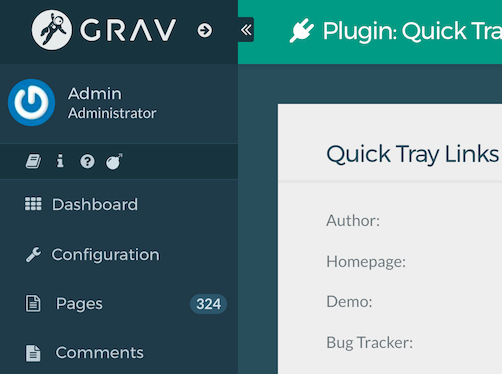

# Quick Tray Links Plugin

The **Quick Tray Links** Plugin is for [Grav CMS](http://github.com/getgrav/grav). Easily add customizable admin quick tray links



## Installation

Installing the Quick Tray Links plugin can be done in one of two ways. The GPM (Grav Package Manager) installation method enables you to quickly and easily install the plugin with a simple terminal command, while the manual method enables you to do so via a zip file.

### GPM Installation (Preferred)

The simplest way to install this plugin is via the [Grav Package Manager (GPM)](http://learn.getgrav.org/advanced/grav-gpm) through your system's terminal (also called the command line).  From the root of your Grav install type:

    bin/gpm install quick-tray-links

This will install the Quick Tray Links plugin into your `/user/plugins` directory within Grav. Its files can be found under `/your/site/grav/user/plugins/quick-tray-links`.

## Configuration

Before configuring this plugin, you should copy the `user/plugins/quick-tray-links/quick-tray-links.yaml` to `user/config/plugins/quick-tray-links.yaml` and only edit that copy.

Here is the default configuration and an explanation of available options:

```yaml
enabled: true
links:
  - icon: fa fa-book
    link: https://learn.getgrav.org
    tooltip: Grav Documentation and Tutorials
    external: true
  - icon: fa fa-info
    link: /admin/config/info
    tooltip: PHP Information
    external: true
```

Possible fields for each link include:

* `icon` - icon classes to render icon
* `link` - Can be a relative URL or an absolute URL
* `tooltip` - The tooltip to display on hover
* `external` - Set to true, to open the link in a new window
* `class` - Any CSS classes you wish to add to the icon link
* `authorize` - A string that can be use to check authorization

## Usage

Simply create a configuration with the links you wish to see displayed in the Quick-Tray area


